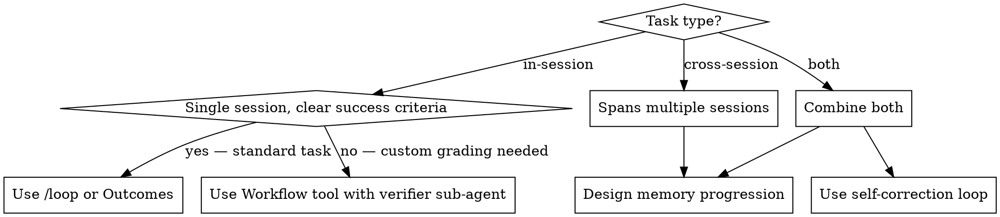

# Fable Loop Design

## Overview

Don't prompt and steer Fable 5 directly. Instead, **design loops that let Fable self-correct in response to environment feedback and manage its own context.** This is the pattern that gets the most out of Mythos-class models.

Two loop types:
1. **Self-correction loops** — within a session, Fable hillclimbs against a rubric until it passes
2. **Memory loops** — across sessions, Fable accumulates and distills verified facts so each session starts smarter than the last

---

## Loop Type 1: Self-Correction

### The pattern

Give Fable a rubric (a file of checkable criteria). Fable runs, collects feedback via the rubric, self-corrects, and repeats until all criteria are satisfied. The loop stops when the rubric passes — not when Fable decides it's done.

```
Fable runs task
    ↓
Verifier sub-agent grades against rubric (independent context window)
    ↓
Pass? → stop
Fail? → Fable reads feedback, corrects, re-runs
```

### Critical: use a verifier sub-agent, not self-critique

Models have problems with self-critique on their own outputs. A verifier sub-agent outperforms self-critique because grading happens in an **independent context window** — the grader has no sunk cost in the prior attempt.

```javascript
// Run loop until rubric passes
let passed = false
let attempt = 0

while (!passed && attempt < maxAttempts) {
  await Agent({
    model: "fable",
    prompt: `Complete the task: <task>. 
             Rubric is at <rubric-path>. 
             Prior feedback (if any): <feedback>.
             Run, then return your output path.`,
  })

  const verdict = await Agent({
    model: "sonnet",   // independent context — not fable grading itself
    prompt: `Grade this output against the rubric at <rubric-path>.
             Output to grade: <output-path>.
             Return: { passed: bool, failed_criteria: string[], feedback: string }`,
    schema: VERDICT_SCHEMA,
  })

  passed = verdict.passed
  feedback = verdict.feedback
  attempt++
}
```

### What makes a good rubric

A rubric is a file of **checkable criteria** — not vague goals. Each criterion must be verifiable by the grader sub-agent without ambiguity.

```markdown
# Rubric: <task name>

- [ ] Ran a baseline before making changes
- [ ] Made at least 5 distinct experiments (not scalar-only tweaks)
- [ ] Each experiment includes a hypothesis, result, and decision
- [ ] Final output improves on baseline by measurable metric
- [ ] No experiment repeated a previously-failed approach without a changed premise
```

### Anthropic primitives for this pattern

| Primitive | What it gives you |
|---|---|
| `/loop` in Claude Code | Re-runs a prompt or slash command until you stop it; built-in loop harness |
| `Outcomes` in Claude Managed Agents | Spawns a grader sub-agent for you; well-suited for long tasks |
| `Workflow` tool | Manual loop with full control over verifier prompt and schema |

Use `/loop` or Outcomes for standard tasks. Use the `Workflow` tool when you need to control what the verifier sees or how feedback is formatted back to Fable.

### Structural vs. scalar experiments

Fable 5 bets on **structural changes** (architecture, approach) and shows resilience through regressions. Opus 4.7 tends to find one small win and then adjust scalars around it.

Design your rubric and loop to reward structural exploration:
- Require a minimum number of experiments
- Require at least one experiment that changes the approach (not just a constant)
- Allow the loop to run through regressions without stopping early

---

## Loop Type 2: Memory (Cross-Session Outer Loop)

### The progression

Effective memory use is a progression. Models exit at different stages:

| Stage | What happens | Sonnet 4.6 | Opus 4.7 | Fable 5 |
|---|---|---|---|---|
| **Fail** | Get something wrong, document it | ✓ (exits here) | ✓ | ✓ |
| **Investigate** | Before moving on, figure out why | rarely | ✓ | ✓ |
| **Verify** | Turn diagnosis into a checked fact | rarely | sometimes | consistently |
| **Distill** | Turn verification into a general rule | rarely | rarely | ✓ |
| **Consult** | Read the rule instead of re-deriving it | rarely | rarely | ✓ |

Sonnet stores failure notes and open guesses. Fable distills verified facts into general rules and then actually reads them.

### Designing for the full progression

Prompt Fable to complete all five stages, not just log failures:

```
After each task attempt:
1. If you failed, document what went wrong and WHY (not just that it failed).
2. Verify your diagnosis — confirm it with a follow-up check before writing it as fact.
3. Write a general rule to memory/rules.md, not a case-specific note.
4. At the start of each new task, READ memory/rules.md before starting.
   Do not re-derive what you've already verified.
```

### Memory structure that works

```
memory/
  rules.md          # General verified rules (distilled, not raw notes)
  schema.md         # Verified schema facts (e.g., "prc is in cents, confirmed Q12")
  open-questions.md # Things not yet verified — flag as unverified
  failures.md       # Raw failure log — source material, not the output
```

The key split: `rules.md` contains only **verified, distilled** facts. Raw notes go in `failures.md` and get promoted to `rules.md` only after verification.

### Cross-session setup in Claude Code

Use the auto-memory system (`~/.claude/projects/<path>/memory/`) or a project-local `memory/` directory:

```javascript
// Each session starts with:
const rules = Read("memory/rules.md")   // consult first

// Each session ends with:
// Fable writes new verified rules → memory/rules.md
// Fable flags open investigations → memory/open-questions.md
```

---

## Choosing the Right Loop



---

## Common Mistakes

| Mistake | Fix |
|---|---|
| Letting Fable grade its own output | Always use a separate model in an independent context window as verifier |
| Rubric criteria that aren't checkable | Every criterion must be falsifiable by the grader — no vague goals |
| Memory = failure log | Failures are raw material; distilled verified rules are the output |
| Stopping the loop on first regression | Fable's biggest wins come after regressions — let it push through |
| Prompting Fable step-by-step | Design the environment (rubric, memory, feedback) and let Fable navigate it |
| Sonnet-style memory (open guesses) | Require verification before promotion to `rules.md`; flag unverified items explicitly |

---

## Quick Reference

| Goal | Tool | Key design choice |
|---|---|---|
| Self-correction within session | `/loop`, Outcomes, `Workflow` | Rubric file + verifier sub-agent |
| Cross-session learning | Memory filesystem | Fail → Investigate → Verify → Distill → Consult |
| Long-running ML/research tasks | Claude Managed Agents + Outcomes | Structural experiment rubric; allow regressions |
| Code quality hillclimbing | `/fable-repo-audit` → self-correction loop | Audit findings as rubric criteria |

## Related Skills

- `/fable-orchestrated-feature-dev` — Fable as planner; use self-correction loop on the implementer output
- `/fable-repo-audit` — produces audit findings that can feed directly into a self-correction rubric
