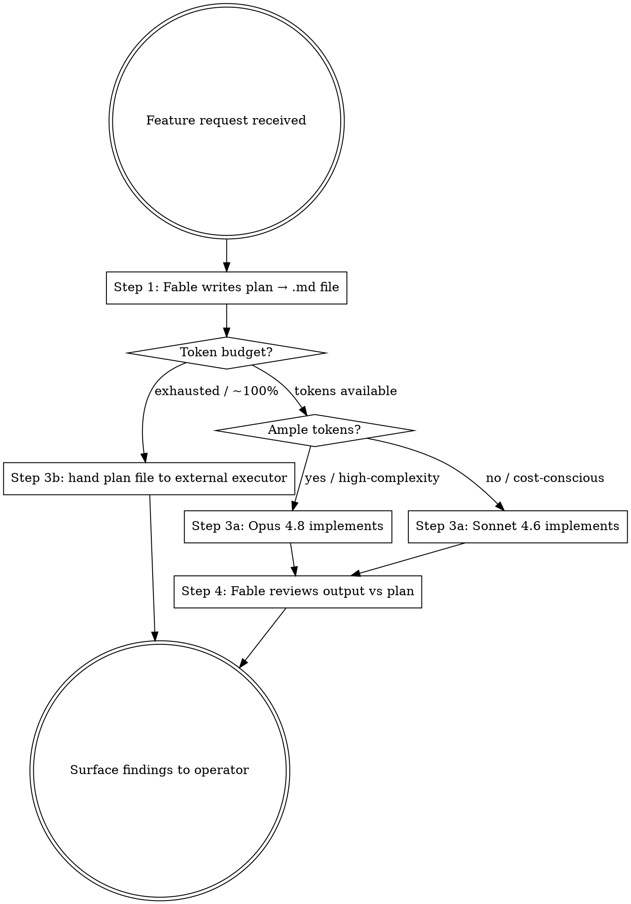

# Fable Orchestrated Feature Dev

## Overview

Fable plans and orchestrates. Advanced models implement. Fable reviews.

**Fable must never write implementation code.** Its role is analysis, planning, and post-implementation review only. Every capable model available today can implement a well-written spec faithfully — use that.

## Flow



---

## Step 1 — Fable writes the plan

Spawn Fable as a planning-only agent. Fable must:

- Read the existing codebase (structure, conventions, affected modules)
- Write a complete, in-depth implementation plan to a timestamped `.md` file at `~/.claude/plans/<slug>-YYYY-MM-DD.md`
- Include: objective, files to create/modify, ordered task list, acceptance criteria, open questions, out-of-scope items
- Return **only the absolute file path** — nothing else

```
Agent({
  model: "fable",
  prompt: `You are the planner. Analyse the codebase and write a complete
implementation plan for: <feature description>.

Save the plan to ~/.claude/plans/<slug>-<date>.md.
Return only the absolute file path as your response.

Do NOT write implementation code. Planning and specification only.`,
})
```

**Gate:** Do not proceed to Step 2 until the `.md` file exists on disk.

---

## Step 2 — Choose the implementer

Read the token budget from context: operator statements ("short on tokens"), session compression signals, or explicit weekly usage notes in memory.

| Signal | Model |
|---|---|
| Tokens ample, feature is complex | `claude-opus-4-8` |
| Tokens moderate or cost-conscious week | `claude-sonnet-4-6` |
| Approaching 100% / operator says exhausted | **External-executor fallback → Step 3b** |

If genuinely unsure, ask one question: *"Opus or Sonnet this week?"*

---

## Step 3a — Implement (Opus or Sonnet)

Open a new Claude Code session or Agent call with the chosen model, passing the plan file path:

```
Agent({
  model: "opus" | "sonnet",   // resolved in Step 2
  prompt: `Implement the feature described in <plan-path> exactly as specified.
Follow all acceptance criteria. Do not deviate from the plan without flagging it.
When done, summarise what was built and note any deviations.`,
})
```

---

## Step 3b — External-executor fallback (tokens exhausted)

Hand the plan file to an external executor (hand the plan file to a cheaper Claude session, Haiku 4.5, or a third-party plan-runner such as Codex). The executor reads the plan and implements autonomously — no further orchestration required from this session. Surface the plan path to the operator so they can monitor the run.

---

## Step 3c — Hosted executor: the plan file as an Outcome rubric (Managed Agents)

The plan's **acceptance criteria are already a rubric**. For long or unattended implementation runs,
hand the plan to a Claude Managed Agents session and let the hosted iterate → grade → revise loop
execute it:

1. Extract the plan's acceptance criteria into a markdown rubric (each criterion independently
   gradeable — the same machine-verifiable discipline the `tasks` skill enforces).
2. Create a CMA session (agent + environment + the repo mounted as a resource), then send:
   ```json
   { "type": "user.define_outcome",
     "description": "Implement the feature exactly as specified in /workspace/repo/<plan>.md",
     "rubric": { "type": "text", "content": "<the acceptance criteria as markdown>" },
     "max_iterations": 5 }
   ```
3. An Anthropic-managed grader scores each iteration against the rubric and feeds gaps back;
   the loop ends `satisfied`, `max_iterations_reached` (default 3, max 20), or `failed`.

This replaces Step 4's manual review with a built-in grading loop — still run Fable's review for
judgment calls the rubric can't capture.

---

## Step 4 — Fable reviews (Opus/Sonnet path only)

After implementation completes, invoke Fable to review against the plan:

```
Agent({
  model: "fable",
  prompt: `Review the implementation against the plan at <plan-path>.
Check every acceptance criterion. Report: which are met, which are missing,
and any deviations from the spec. Report findings only — do not rewrite code.`,
})
```

Surface Fable's findings to the operator before closing the session.

---

## Model Reference

| Model ID | Alias | Role |
|---|---|---|
| `claude-fable-5` | `fable` | Planner, orchestrator, reviewer — **never coder** |
| `claude-opus-4-8` | `opus` | Implementer — complex features, ample token budget |
| `claude-sonnet-4-6` | `sonnet` | Implementer — standard features, cost-conscious weeks |
| External executor | — | Token-exhausted fallback implementer (any plan-runner, e.g. a cheaper Claude session or Codex) |

---

## Common Mistakes

| Mistake | Fix |
|---|---|
| Fable writes implementation code | Fable prompt must say "planning only" explicitly — reject any code output |
| Skipping the `.md` file | The plan file is the handoff artifact; an external executor needs it as a file path, not inline text |
| Choosing Opus when tokens are tight | Check budget signal *before* spawning the implementer, not after |
| Passing plan content inline instead of path | Always pass the absolute file path — lets executors and future sessions re-read it |
| Letting Fable review its own plan | Fable reviews the *implementation output*, not the plan it wrote |
