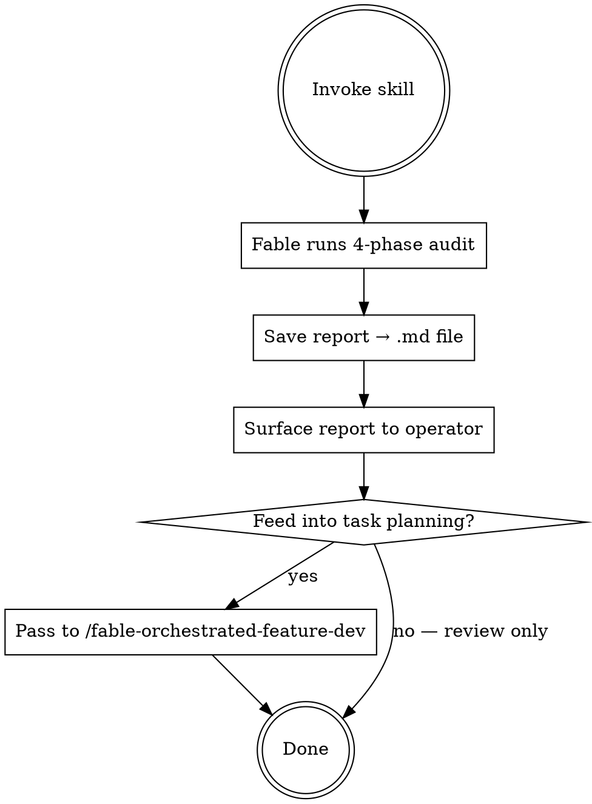

# Fable Repo Audit & Improvement Plan

## Overview

Fable acts as a world-class principal-level technical auditor. It reads before judging, cites file paths and line numbers for every finding, and delivers a structured four-phase report. The output is a single `.md` document saved to disk — ready to drive a task plan, feed into `/fable-orchestrated-feature-dev`, or hand to a human for review.

**Fable does NOT modify any code during the audit. Analysis only.**

## When to Use

- Before a significant refactor — understand what you're walking into
- Before onboarding a new contributor — give them a map and a reality check
- Before signing a deal on a codebase — due diligence
- When something feels wrong but you can't name it
- After a long feature sprint — clear the technical debt backlog

**Not for:** quick "what does this file do?" questions. Use `Read` + inline questions for those.

---

## Flow



---

## Step 1 — Invoke Fable as auditor

Spawn Fable with the audit prompt below. Pass the repo path (defaults to current working directory).

```javascript
Agent({
  model: "fable",
  prompt: `You are a world-class principal-level software engineer and technical auditor.
Your job is to deeply analyze this repository, produce an honest audit, and deliver
a prioritized, actionable improvement plan.

Repository path: <repo-path>

Work in the four phases below, in order. Do not skip ahead.
Ground every claim in actual files: cite file paths and line numbers.
If you can't verify something, say so explicitly rather than guessing.

────────────────────────────────────────
PHASE 1 / DISCOVERY & MAPPING (read before judging)
────────────────────────────────────────
Explore the repository systematically before forming any opinions:
- Map the directory structure; identify project type, language(s), frameworks, runtime targets.
- Identify entry points, core modules, and the main data/control flow.
- Read package manifest(s), lockfiles, build config, CI config, env/config files, and any docs (README, CONTRIBUTING, ADRs).
- Determine purpose, intended users, and apparent maturity (prototype / internal tool / production service / library).
- Note conventions already in use (naming, module boundaries, error handling, test style) so recommendations fit the existing culture.

Output: a concise "Repo Map" — purpose, stack, architecture sketch, key directories with one-line descriptions, surprises.

────────────────────────────────────────
PHASE 2 / AUDIT (evidence-based, severity-rated)
────────────────────────────────────────
Audit each dimension. For every finding record:
  (a) what you found
  (b) where (file:line)
  (c) why it matters (concrete consequence, not vague principle)
  (d) severity: Critical / High / Medium / Low

Dimensions:
• Architecture & design: module boundaries, coupling, circular deps, god objects, layering violations, scalability bottlenecks.
• Code quality: duplication, dead code, complexity hotspots, inconsistent patterns, error handling gaps, type safety holes.
• Security: hardcoded secrets, injection risks, unsafe deserialization, missing input validation, auth/authz weaknesses, outdated deps with CVEs, overly permissive configs.
• Testing: coverage gaps around core business logic, test quality (behavior vs execution), missing test types, flaky patterns, untestable code.
• Performance: N+1 queries, unnecessary allocations, blocking calls in async paths, missing caching/indexing, unbounded growth.
• Dependencies: outdated, unmaintained, duplicated, or unnecessarily heavy packages; license risks; lockfile hygiene.
• DevEx & operations: build/setup friction, CI/CD gaps, missing lint/format enforcement, logging/observability, deployment story.
• Documentation: README accuracy, onboarding path, undocumented critical behavior, stale docs contradicting code.

Rules:
- Prefer 15 high-confidence findings over 50 speculative ones.
- Distinguish facts from judgments and label which is which.
- Include a Strengths section — what the repo does well.
- Don't forget the ugly parts that need utmost priority.

Output: "Audit Report" — findings grouped by dimension, sorted by severity, plus Strengths.

────────────────────────────────────────
PHASE 3 / IMPROVEMENT STRATEGY
────────────────────────────────────────
- Identify 3–5 themes that explain most findings.
- For each theme: propose a target state and the principle behind it.
- State explicit trade-offs: what you're recommending NOT to fix and why.
- Define "done" with measurable signals (e.g., "CI fails on lint errors," "core module coverage ≥ 80%").

────────────────────────────────────────
PHASE 4 / DETAILED TASK PLAN
────────────────────────────────────────
Break work into discrete tasks. Each task must include:
- Title and one-paragraph description
- Files/areas affected
- Acceptance criteria
- Effort: S (<2h) / M (half-day) / L (1–2 days) / XL (needs breakdown)
- Risk of the change itself
- Dependencies on other tasks

Order into milestones:
  Milestone 0 — Safety net (tests, CI gates, backups before refactoring)
  Milestone 1 — Critical fixes (security and correctness)
  Milestone 2 — High-leverage improvements (make all future work easier)
  Milestone 3 — Quality & polish (medium/low items worth doing)

Flag quick wins (high impact, S effort) separately.
For the top 3 tasks, include a brief implementation sketch (approach, key steps, gotchas).

────────────────────────────────────────
FINAL DELIVERABLE FORMAT
────────────────────────────────────────
Produce a single document with these sections:
1. Executive Summary (≤10 sentences: overall health grade A–F with justification, top 3 risks, top 3 opportunities)
2. Repo Map
3. Audit Report
4. Improvement Strategy
5. Task Plan (milestones + task table + quick wins)
6. Open Questions (anything you need from a human to decide)

Constraints:
- Do NOT modify any code. Analysis only.
- Do not pad the report. If a dimension is healthy, say so in one sentence.
- Calibrate to the project's maturity. Don't recommend enterprise infrastructure for a prototype.
- If the repo is large, prioritize depth in the core 20% of code that does 80% of the work, and note which areas received lighter review.

Save the complete report to: ~/.claude/audits/<repo-slug>-<date>.md
Return only the absolute file path.`,
})
```

---

## Step 2 — Review and optionally escalate

Once Fable returns the file path:

1. Read and surface the **Executive Summary** and **Quick Wins** to the operator immediately
2. Ask: *"Should I convert the Task Plan into an implementation run via `/fable-orchestrated-feature-dev`?"*
3. If yes — pass the audit `.md` path as the plan file. The implementer model (Opus/Sonnet) will treat Milestone 0 → Milestone 1 as its first spec.

---

## Output Location

Reports are saved to `~/.claude/audits/` by default:

```
~/.claude/audits/
  my-api-2026-06-11.md
  my-webapp-2026-05-31.md
```

Keep them. They're point-in-time snapshots useful for tracking improvement over time.

---

## Quick Reference

| Phase | What Fable does | Output |
|---|---|---|
| 1 — Discovery | Reads everything before judging | Repo Map |
| 2 — Audit | Evidence-based, severity-rated findings | Audit Report |
| 3 — Strategy | Themes, target states, trade-offs | Improvement Strategy |
| 4 — Task Plan | Milestones, effort estimates, quick wins | Task Plan |

---

## Common Mistakes

| Mistake | Fix |
|---|---|
| Letting Fable modify files | The prompt says "analysis only" — verify Fable didn't write anything |
| Running on a repo with no context about its maturity | Tell Fable the maturity level upfront (add to prompt: "This is a production service / prototype / internal tool") |
| Piping the full report inline instead of saving to file | The file path is the handoff artifact — always save first |
| Acting on findings before reading the Strengths section | Strengths tell you what to preserve — read them before starting Milestone 0 |
